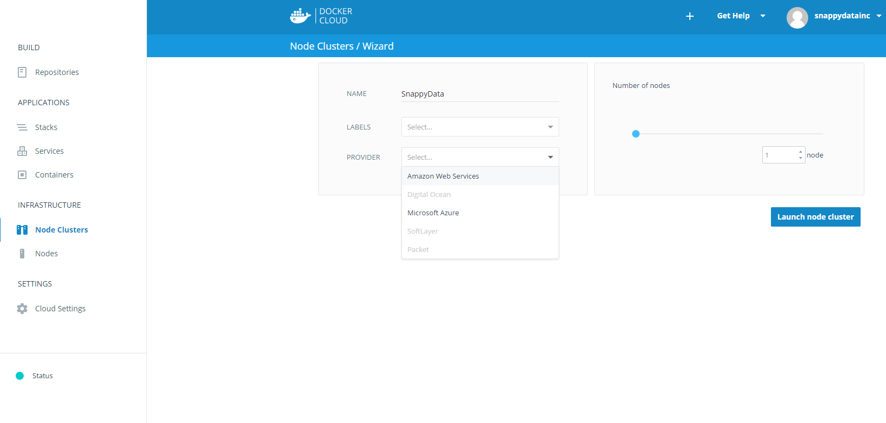
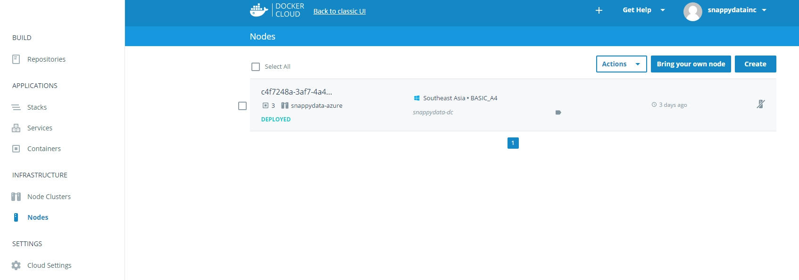
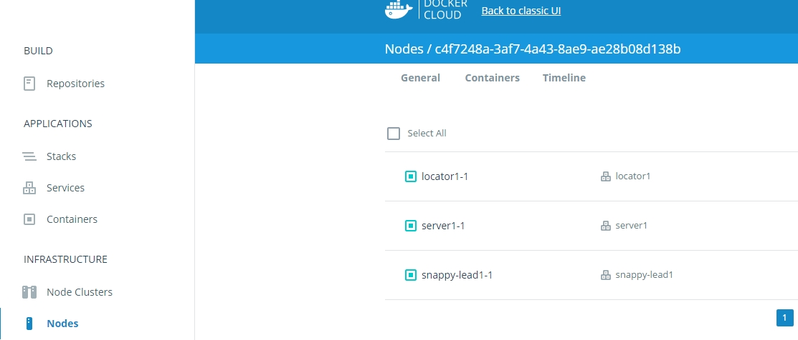
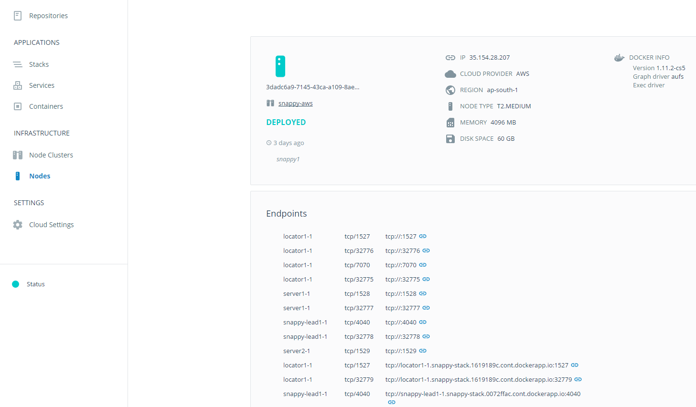
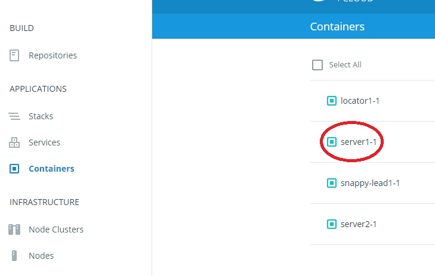
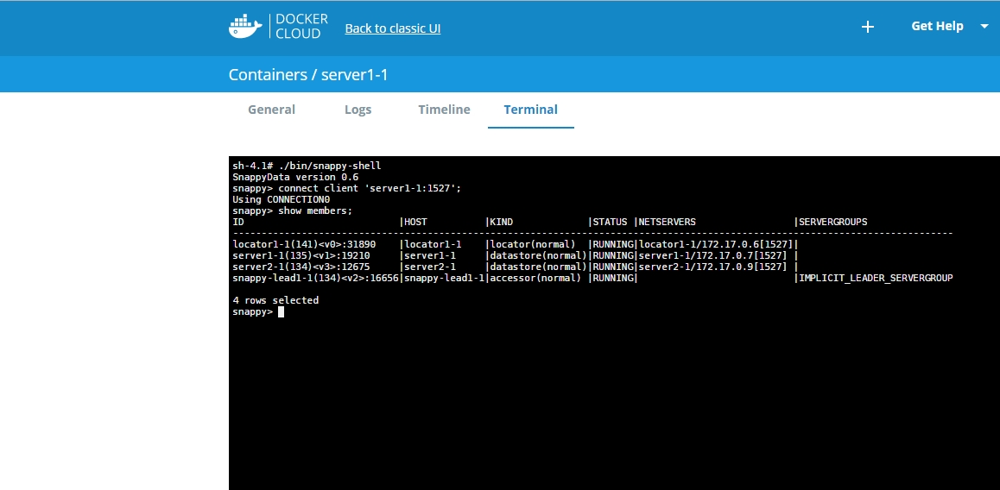
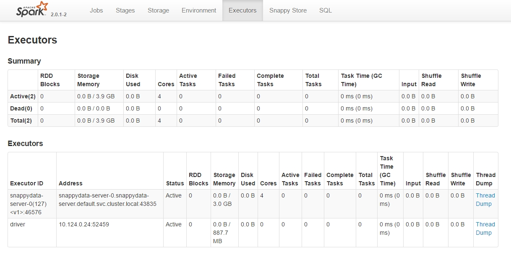

## Table of Contents


* [Setting up Cluster with SnappyData Docker Image](#setting-up-cluster-with-snappydata-docker-image)
* [Using docker-compose on Multiple Containers](#using-multiple-containers-with-docker-compose)
* [SnappyData on Docker Cloud](#run-snappydata-on-docker-cloud)
* [SnappyData with Docker Swarm](#snappydata-with-docker-swarm)
* [Using Kubernetes](#using-kubernetes)

## Setting up Cluster with SnappyData Docker Image
###Prerequisites

* This guide assumes that Docker have been installed and configured. Refer to [Docker documentation](http://docs.docker.com/installation) for more information.
* Ensure that Docker containers have access to at least 4GB of RAM on your machine. 
* If you are running Docker on a Mac or PC you may need to modify the RAM used by the virtual machine which is
running the Docker daemon. For more information, refer to the Docker documentation.

**Verify that your installation is working correctly**

```
$ docker run hello-world
```

**Start a basic cluster with one data node, one lead and one locator**

**For Linux**

```
$ docker run -itd --net=host --name snappydata snappydatainc/snappydata start all
```
**For OSX**

On MAC OS docker works bit different than linux, so if we use "--net=host" it may not behave properly. But we can redirect ports manually.

Below is the example command to start SnappyData Cluster on OSX.

```
docker run -d --name=snappydata -p 4040:4040 -p 1527:1527 -p 1528:1528 snappydatainc/snappydata start all -J-Dgemfirexd.hostname-for-clients=<Machine_IP/Public_IP>
```

`-J-Dgemfirexd.hostname-for-clients`  Sets the ip address or host name that this server is to listen on for client connections.


**Check the Docker process**

```
$ docker ps -a
```
<Note>Note: Wait for a few seconds before running the next command.</Note>

**Check the Docker logs**<br>
The following command displays the logs of container process. The query results display “Distributed system now has 3 members”.


```
$ docker logs snappydata
starting sshd service
Starting sshd:
 [ OK ]
Starting SnappyData Locator using peer discovery on: localhost[10334]
Starting DRDA server for SnappyData at address localhost/127.0.0.1[1527]
Logs generated in /opt/snappydata/work/localhost-locator-1/snappylocator.log
SnappyData Locator pid: 110 status: running
Starting SnappyData Server using locators for peer discovery: localhost:10334
Starting DRDA server for SnappyData at address localhost/127.0.0.1[1527]
Logs generated in /opt/snappydata/work/localhost-server-1/snappyserver.log
SnappyData Server pid: 266 status: running
Distributed system now has 2 members.
Other members: localhost(110:locator)<v0>:63369
Starting SnappyData Leader using locators for peer discovery: localhost:10334
Logs generated in /opt/snappydata/work/localhost-lead-1/snappyleader.log
SnappyData Leader pid: 440 status: running
Distributed system now has 3 members.
Other members: 192.168.1.130(266:datastore)<v1>:47290, localhost(110:locator)<v0>:63369

```

**Connect SnappyData with the Command Line Client**
```
$ docker exec -it snappydata ./bin/snappy-shell
```
**Connect Client on port “1527”**

```
$ snappy> connect client 'localhost:1527';
```

**View Connections**

```
snappy> show connections;
CONNECTION0* -
 jdbc:gemfirexd://localhost[1527]/
* = current connection

```
**Check Member Status**

```
snappy> show members;
```

**Stop the Cluster**

```
$ docker exec -it snappydata ./sbin/snappy-stop-all.sh
The SnappyData Leader has stopped.
The SnappyData Server has stopped.
The SnappyData Locator has stopped.
```

**Stop SnappyData Container**
```
$ docker stop snappydata
```


###Using Multiple Containers with docker-compose

Install docker-compose from [Docker documentation](https://docs.docker.com/compose/install/) 

Verify installation by checking version of docker-compose

```
$ docker-compose -v
docker-compose version 1.8.1, build 878cff1
```

Use [docker-compose.yml](https://raw.githubusercontent.com/SnappyDataInc/snappy-cloud-tools/master/docker/docker-compose.yml) file to run docker-compose.

Before using docker-compose.yml , We will need to first expose the external IP of machine so that client can make connections on that.

```
export EXTERNAL_IP=<your machine ip>
```


```
$ docker-compose up -d
Creating network "docker_default" with the default driver
Creating locator1_1
Creating server1_1
Creating snappy-lead1_1
```

It will create three containers, 

```
$ docker-compose ps
        Name                       Command               State                                          Ports
----------------------------------------------------------------------------------------------------------------------------------------------------
locator1_1       bash -c /opt/snappydata/sb ...   Up      10334/tcp, 0.0.0.0:1527->1527/tcp, 1528/tcp, 4040/tcp, 7070/tcp, 7320/tcp, 8080/tcp
server1_1        bash -c sleep 10 && /opt/s ...   Up      10334/tcp, 1527/tcp, 0.0.0.0:1528->1528/tcp, 4040/tcp, 7070/tcp, 7320/tcp, 8080/tcp
snappy-lead1_1   bash -c sleep 20 && /opt/s ...   Up      10334/tcp, 1527/tcp, 1528/tcp, 0.0.0.0:4040->4040/tcp, 7070/tcp, 7320/tcp, 8080/tcp
```

Check the logs and see what is running inside docker-compose

```
$ docker-compose logs
Attaching to snappy-lead1_1, server1_1, locator1_1
server1_1       | Starting SnappyData Server using locators for peer discovery: locator1:10334
server1_1       | Starting DRDA server for SnappyData at address server1/172.18.0.3[1528]
snappy-lead1_1  | Starting SnappyData Leader using locators for peer discovery: locator1:10334
server1_1       | Logs generated in /opt/snappydata/work/localhost-server-1/snappyserver.log
snappy-lead1_1  | Logs generated in /opt/snappydata/work/localhost-lead-1/snappyleader.log
server1_1       | SnappyData Server pid: 83 status: running
snappy-lead1_1  | SnappyData Leader pid: 83 status: running
server1_1       |   Distributed system now has 2 members.
snappy-lead1_1  |   Distributed system now has 3 members.
snappy-lead1_1  |   Other members: docker_server1_1(83:datastore)<v1>:53707, locator1(87:locator)<v0>:44102
server1_1       |   Other members: locator1(87:locator)<v0>:44102
locator1_1      | Starting SnappyData Locator using peer discovery on: locator1[10334]
locator1_1      | Starting DRDA server for SnappyData at address locator1/172.18.0.2[1527]
locator1_1      | Logs generated in /opt/snappydata/work/localhost-locator-1/snappylocator.log
locator1_1      | SnappyData Locator pid: 87 status: running
```

Above logs shows your cluster has been started successfully on three containers.

**Connect SnappyData with the Command Line Client on server1_1**

```
$ docker exec -it server1_1 ./bin/snappy-shell
```

```
$ snappy> connect client 'localhost:1528';
```

**View Connections**

```
snappy> show connections;
CONNECTION0* -
 jdbc:gemfirexd://localhost[1528]/
* = current connection
```

**Stopping docker-compose**

To stop and remove containers from docker-engine

```
$ docker-compose down
Stopping snappy-lead1_1 ... done
Stopping server1_1 ... done
Stopping locator1_1 ... done
Removing snappy-lead1_1 ... done
Removing server1_1 ... done
Removing locator1_1 ... done
Removing network docker_default
```

Note : After removing containers from docker engine will destroy saved data in to the containers. 


##Run SnappyData on Docker Cloud
Image : snappydatainc/snappydata Tag : latest


Docker Cloud is Docker's official platform for building, managing and deploying Docker containers across a variety of cloud providers and a provides features ideal for Development workflows. 

to connect cloud on AWS,AZURE and Digital Ocean follow the official
[documentation](https://docs.docker.com/docker-cloud/infrastructure/link-aws/) on docker cloud


**Prerequisites**

By default SnappyData Docker image exposes "4040, 7070, 1527, 10334, 8080", You will need to allow these ports in cloud instance by creating appropriate security groups.


**Connect Cloud Providers**

The first step is to connect the cloud hosting providers you would like
to use with Docker Cloud. The current options are Amazon Web Services,
Digital Ocean, Microsoft Azure, Softlayer and Packet and BYOH ( Bring
your own host )

Website: http://cloud.docker.com

Got to *Nodes* tab and click on *Create.*Provide the information of Cloud
providers.
<br><br>
<p style="text-align: center;"></p>
<br><br>
After Couple of minutes your node will be ready ( see below example with
Azure in our case)
<br><br>
<p style="text-align: center;"></p>
<br><br>
1. Click on the Stacks tab, then the Create button. Give the Stack a name and add [this](https://raw.githubusercontent.com/SnappyDataInc/snappy-cloud-tools/master/docker/docker-cloud/stack.yml) code 

```
locator1:
  command: start locator
  ports:
   - '1527:1527'
   - '10334:10334'
  image: 'snappydatainc/snappydata:latest'
  restart: always
  target_num_containers: 1
  working_dir: /opt/snappydata/
server1:
  command: 'bash -c "sleep 10 && start server -locators=locator1:10334 -client-port=1528 -J-Dgemfirexd.hostname-for-clients=$DOCKERCLOUD_CONTAINER_FQDN"'
  image: 'snappydatainc/snappydata:latest'
  restart: always
  target_num_containers: 1
  links:
   - locator1
  ports:
   - '1528:1528'
  sequential_deployment: true
  working_dir: /opt/snappydata/
snappy-lead1:
  command: 'bash -c "sleep 20 && start lead -locators=locator1:10334"'
  image: 'snappydatainc/snappydata:latest'
  restart: always
  target_num_containers: 1
  links:
   - server1
  ports:
   - '4040:4040'
  sequential_deployment: true
  working_dir: /opt/snappydata/
```  

<br><br>
Click the Create stack button and you will see a list of the resulting services not yet running. 
<br><br>
Click the “start” button . After a few moments you will see our three node SnappyData cluster spread across containers and nodes. We have used Docker Cloud's default approach to load balancing (Emptiest Node) but there are many to choose from. As we are setting one set of ports manually, this will limit some of our potential deployment strategies. 
<br><br>
<p style="text-align: center;"></p>
<br><br>
To double check what is happening, click the *Nodes* tab, on *container*you should see the 1 VMs, with 3 containers running.
<br><br>
<p style="text-align: center;"></p>
<br><br>
Check public ip from “nodes” tab clicking on any nodes. 
<br><br>
<p style="text-align: center;"></p>
<br><br>
You can also check the snappy-shell on running containers
<br><br>
<p style="text-align: center;"></p>
<br><br>
Select the server container and go the *terminal*
<br><br>
<p style="text-align: center;"></p>
<br><br>
**Conclusion** 

The real potential in the Docker Cloud lies in its simple scalability through a user-friendly UI (and CLI) which pairs well with SnappyData, this has been a simple, 'getting started' example and we recommend you look further at [Docker Cloud's documentation](https://docs.docker.com/docker-cloud/) to explore its full potential.

##SnappyData With Docker Swarm

This article explains how to setup multi-host snappydata cluster using docker swarm , docker-machine and docker-compose

###Prerequisites
Before you begin, make sure you have a system on your network with the latest version of Docker Engine , Docker Machine and docker-compose installed. The example also relies on VirtualBox. If you installed on a Mac or Windows with Docker Toolbox, you have all of these installed already.

**Step 1: Set up a key-value store**

An overlay network requires a key-value store. The key-value store holds information about the network state which includes discovery, networks, endpoints, IP addresses, and more. Docker supports Consul, Etcd, and ZooKeeper key-value stores. We will use consul.

Log into a system prepared with the prerequisite Docker Engine, Docker Machine, and VirtualBox software.

Create virtual machine called mh-keystore

```
$ docker-machine create -d virtualbox mh-keystore
```
Set your local environment to the mh-keystore machine.

```
$ eval "$(docker-machine env mh-keystore)"
```
Start a  progrium/consul  container running  on the  mh-keystore  machine

```
$ docker run -d -p "8500:8500" -h "consul" progrium/consul -server -bootstrap
```

**Step 2: Create a Swarm cluster**

Create a Swarm master.

```
$ docker-machine create \
   -d virtualbox \
   --virtualbox-memory 4096
   --swarm --swarm-master \
   --swarm-discovery="consul://$(docker-machine ip mh-keystore):8500" \
   --engine-opt="cluster-store=consul://$(docker-machine ip mh-keystore):8500" \
   --engine-opt="cluster-advertise=eth1:2376" \
   snappy-swarm0
```

Create another two host and add it to the Swarm cluster.

```
$ docker-machine create \
   -d virtualbox \
   --virtualbox-memory 4096
   --swarm \
   --swarm-discovery="consul://$(docker-machine ip mh-keystore):8500" \
   --engine-opt="cluster-store=consul://$(docker-machine ip mh-keystore):8500" \
   --engine-opt="cluster-advertise=eth1:2376" \
   snappy-swarm1
```
<br><br>
```
$ docker-machine create \
  -d virtualbox \
  --virtualbox-memory 4096
  --swarm \
  --swarm-discovery="consul://$(docker-machine ip mh-keystore):8500" \
  --engine-opt="cluster-store=consul://$(docker-machine ip mh-keystore):8500" \
  --engine-opt="cluster-advertise=eth1:2376" \
  snappy-swarm2
```

List your machines to confirm they are all up and running.

```
$ docker-machine ls
NAME            ACTIVE   DRIVER       STATE     URL                         SWARM                    DOCKER    ERRORS
mh-keystore     *        virtualbox   Running   tcp://192.168.99.100:2376                            v1.12.3
snappy-swarm0   -        virtualbox   Running   tcp://192.168.99.104:2376   snappy-swarm0 (master)   v1.12.3
snappy-swarm1   -        virtualbox   Running   tcp://192.168.99.105:2376   snappy-swarm0            v1.12.3
snappy-swarm2   -        virtualbox   Running   tcp://192.168.99.106:2376   snappy-swarm0            v1.12.3
```

At this point you have a set of hosts running on your network. You are ready to create a multi-host network for containers using these hosts.
Leave your terminal open and go onto the next step.

**Step3: Copy SnappyData image in three machines**


Pull latest image of snappydata and save it in temp directory
```
$ docker-machine ssh snappy-swarm0 'docker pull snappydatainc/snappydata;docker save -o /tmp/snappydata.tar snappydatainc/snappydata:latest'
```

Copy image to other virtual machines 

```
$ docker-machine scp snappy-swarm0:/tmp/snappydata.tar snappy-swarm1:/tmp/snappydata.tar
$ docker-machine scp snappy-swarm0:/tmp/snappydata.tar snappy-swarm2:/tmp/snappydata.tar
```
Load the image on virtual machines

```
$ docker-machine ssh snappy-swarm1 "docker load -i /tmp/snappydata.tar"
$ docker-machine ssh snappy-swarm2 "docker load -i /tmp/snappydata.tar"
```


**Step 4: Run SnappyData on Network**

Point your environment to the Swarm master.

```
$ eval $(docker-machine env --swarm snappy-swarm0)
```

Use docker info to view swarm

```
$ docker info
Containers: 4
 Running: 4
 Paused: 0
 Stopped: 0
Images: 6
Server Version: swarm/1.2.5
Role: primary
Strategy: spread
Filters: health, port, containerslots, dependency, affinity, constraint
Nodes: 3
 snappy-swarm0: 192.168.99.104:2376
  └ ID: THKK:ZYSX:BSRW:XVT5:DWR7:JUVU:JW4M:TIWJ:OBYE:SD3O:SKVH:EXBG
  └ Status: Healthy
  └ Containers: 2 (2 Running, 0 Paused, 0 Stopped)
  └ Reserved CPUs: 0 / 1
  └ Reserved Memory: 0 B / 1.021 GiB
  └ Labels: kernelversion=4.4.27-boot2docker, operatingsystem=Boot2Docker 1.12.3 (TCL 7.2); HEAD : 7fc7575 - Thu Oct 27 17:23:17 UTC 2016, provider=virtualbox, storagedriver=aufs
  └ UpdatedAt: 2016-12-13T09:15:04Z
  └ ServerVersion: 1.12.3
 snappy-swarm1: 192.168.99.105:2376
  └ ID: CAXT:FMFA:42DW:U66A:YUO4:QHQF:PXQE:BNVE:CHLX:EVIT:LB32:RAHX
  └ Status: Healthy
  └ Containers: 1 (1 Running, 0 Paused, 0 Stopped)
  └ Reserved CPUs: 0 / 1
  └ Reserved Memory: 0 B / 1.021 GiB
  └ Labels: kernelversion=4.4.27-boot2docker, operatingsystem=Boot2Docker 1.12.3 (TCL 7.2); HEAD : 7fc7575 - Thu Oct 27 17:23:17 UTC 2016, provider=virtualbox, storagedriver=aufs
  └ UpdatedAt: 2016-12-13T09:15:21Z
  └ ServerVersion: 1.12.3
 snappy-swarm2: 192.168.99.106:2376
  └ ID: 73AX:EVEW:AW7X:3UYW:X6UE:DRVU:LQMC:R5AR:VMHV:GHP6:BZ6D:T5LH
  └ Status: Healthy
  └ Containers: 1 (1 Running, 0 Paused, 0 Stopped)
  └ Reserved CPUs: 0 / 1
  └ Reserved Memory: 0 B / 1.021 GiB
  └ Labels: kernelversion=4.4.27-boot2docker, operatingsystem=Boot2Docker 1.12.3 (TCL 7.2); HEAD : 7fc7575 - Thu Oct 27 17:23:17 UTC 2016, provider=virtualbox, storagedriver=aufs
  └ UpdatedAt: 2016-12-13T09:15:16Z
  └ ServerVersion: 1.12.3
```


From this information, you can see that you are running 3 nodes running on swarm master


**Step 5: Run SnappyData on Swarm**

Use below [docker-compose.yml](https://raw.githubusercontent.com/SnappyDataInc/snappy-cloud-tools/master/docker/docker-compose.yml)  file 


```
version: '2'
services:
 locator1:
     image: snappydatainc/snappydata
     working_dir: /opt/snappydata/
     command: bash -c "/opt/snappydata/sbin/snappy-locators.sh start -peer-discovery-address=locator1 -client-bind-address=0.0.0.0 && tail -f /dev/null"  
     ports:
       - "1527:1527"
     expose:
       - "10334"
       - "1527"
 server1:
     image: snappydatainc/snappydata
     working_dir: /opt/snappydata/
     command: bash -c "sleep 10 && /opt/snappydata/sbin/snappy-servers.sh start -locators=locator1:10334 -client-bind-address=0.0.0.0 -client-port=1528 && tail -f /dev/null"
     expose:
       - "10334"
       - "1528"
     ports:
       - "1528:1528"
     depends_on:
       - "locator1"
 snappy-lead1:
     image: snappydatainc/snappydata
     working_dir: /opt/snappydata/
     command: bash -c "sleep 20 && /opt/snappydata/sbin/snappy-leads.sh start -locators=locator1:10334 && tail -f /dev/null"
     depends_on:
      - "server1"
     ports:
      - "4040:4040"
```

Run the docker-compose with docker-compose.yml file

```
$ docker-compose -f docker-compose.yml up -d
Creating network "default" with the default driver
Creating locator1_1
Creating server1_1
Creating snappy-lead1_1
```

Verify the compose process

```
$ docker-compose ps
Name                       Command               State                                             Ports
-----------------------------------------------------------------------------------------------------------------------------------------------------------
locator1_1       bash -c /opt/snappydata/sb ...   Up      10334/tcp, 192.168.99.105:1527->1527/tcp, 1528/tcp, 4040/tcp, 7070/tcp, 7320/tcp, 8080/tcp
server1_1        bash -c sleep 10 && /opt/s ...   Up      10334/tcp, 192.168.99.106:1527->1527/tcp, 1528/tcp, 4040/tcp, 7070/tcp, 7320/tcp, 8080/tcp
snappy-lead1_1   bash -c sleep 20 && /opt/s ...   Up      10334/tcp, 1527/tcp, 1528/tcp, 192.168.99.104:4040->4040/tcp, 7070/tcp, 7320/tcp, 8080/tcp
```
Within few seconds cluster will be up.


##Using Kubernetes

Kubernetes is a container orchestration platform that you can use to manage and scale your running containers across multiple instances or within a hybrid-cloud environment


**Prerequisites**

This example requires a running Kubernetes cluster. First, check that kubectl is properly configured by getting the cluster state:

```
$ kubectl cluster-info
```
If you see a url response, you are ready to go. If not, read the [Getting Started guides](http://kubernetes.io/docs/getting-started-guides/) for how to get started, and follow the [prerequisites](http://kubernetes.io/docs/user-guide/prereqs/) to install and configure kubectl. As noted above, if you have a Google Container Engine cluster set up, read [this example](https://cloud.google.com/container-engine/docs/tutorials/guestbook) instead.


**Use a PetSet to create SnappyData Services**

In Kubernetes, most pod management abstractions group them into disposable units of work that compose a micro service. Replication controllers for example, are designed with a weak guarantee - that there should be N replicas of a particular pod template. The pods are treated as stateless units, if one of them is unhealthy or superseded by a newer version, the system just disposes it. [Please refer to the PetSet documentation.](http://kubernetes.io/docs/user-guide/petset/)

Creates a SnappyData cluster that consists of three pods using [snappydata.yml](https://raw.githubusercontent.com/SnappyDataInc/snappy-cloud-tools/master/docker/kubernetes/snappydata.yml) PetSet.

```
$ kubectl create -f snappydata.yml
service "snappydata-locator-public" created
service "snappydata-server-public" created
service "snappydata-leader-public" created
service "snappydata-locator" created
service "snappydata-server" created
service "snappydata-leader" created
petset "snappydata-locator" created
petset "snappydata-server" created
petset "snappydata-leader" created
```

List created pods by `snappydata.yml`

```
$ kubectl get pods
NAME                   READY     STATUS    RESTARTS   AGE
snappydata-leader-0    1/1       Running   0          2h
snappydata-locator-0   1/1       Running   0          2h
snappydata-server-0    1/1       Running   0          2h
```

Check logs of locator

```
$ kubectl logs snappydata-locator-0
Starting sshd: [  OK  ]
172.17.0.4: Warning: Permanently added '172.17.0.4' (RSA) to the list of known hosts.
172.17.0.4: Starting SnappyData Locator using peer discovery on: 172.17.0.4[10334]
172.17.0.4: Starting DRDA server for SnappyData at address /172.17.0.4[1527]
172.17.0.4: Logs generated in /opt/snappydata/work/172.17.0.4-locator-1/snappylocator.log
172.17.0.4: SnappyData Locator pid: 129 status: running
```
Then, list all your Services:

```
$ kubectl get services
NAME                        CLUSTER-IP       EXTERNAL-IP       PORT(S)                                                   AGE
kubernetes                  10.127.240.1     <none>            443/TCP                                                   29m
snappydata-leader           None             <none>            26257/TCP,8080/TCP,10334/TCP,3768/TCP,1531/TCP,1527/TCP   3m
snappydata-leader-public    10.127.246.173   <pending>         4040/TCP                                                  3m
snappydata-locator          None             <none>            26257/TCP,8080/TCP,10334/TCP,3768/TCP,1531/TCP,1527/TCP   3m
snappydata-locator-public   10.127.252.128   <pending>         1527/TCP,10334/TCP,7070/TCP                               3m
snappydata-server           None             <none>            26257/TCP,8080/TCP,10334/TCP,3768/TCP,1531/TCP,1527/TCP   3m
snappydata-server-public    10.127.244.246   <pending>         1527/TCP,10334/TCP                                        3m
```


**Using 'type: LoadBalancer' for the frontend service (cloud-provider-specific)**

For supported cloud providers, such as Google Compute Engine or Google Container Engine, you can specify to use an external load balancer in the service spec, to expose the service onto an external load balancer IP. To do this use `type: LoadBalancer`
Below is the example of creating a service with `type: LoadBalancer`

```
apiVersion: v1
kind: Service
metadata:
  name: snappydata-locator-public
  labels:
    app: snappydata
spec:
  ports:
  - port: 1527
    targetPort: 1527
    name: jdbc
  - port: 10334
    targetPort: 10334
    name: locator
  - port: 7070
    targetPort: 7070
    name: pulse
  type: LoadBalancer
  selector:
    app: snappydata-locator
---
```

**Troubleshooting**

If you are having trouble bringing up SnappyData Services, double check that your external IP is properly defined for your frontend Service, and that the firewall for your cluster nodes is open to port `1527, 10334, 8080, 4040, 7070` .

**Accessing the SnappyData externally**

You'll want to set up your SnappyData so that it can be accessed from outside of the internal Kubernetes network. Above, we introduced one way to do that, by setting `type: LoadBalancer` to Service `spec`.
More generally, Kubernetes supports two ways of exposing a Service onto an external IP address: `NodePort`s and `LoadBalancer`s

If the `LoadBalancer` specification is used, it can take a short period for an external IP to show up in `kubectl get services` output, but you should then see it listed as well, e.g. like this:

```
$ kubectl get services
NAME                        CLUSTER-IP       EXTERNAL-IP       PORT(S)                                                   AGE
kubernetes                  10.127.240.1     <none>            443/TCP                                                   29m
snappydata-leader           None             <none>            26257/TCP,8080/TCP,10334/TCP,3768/TCP,1531/TCP,1527/TCP   3m
snappydata-leader-public    10.127.246.173   130.211.155.29    4040/TCP                                                  3m
snappydata-locator          None             <none>            26257/TCP,8080/TCP,10334/TCP,3768/TCP,1531/TCP,1527/TCP   3m
snappydata-locator-public   10.127.252.128   104.198.247.10    1527/TCP,10334/TCP,7070/TCP                               3m
snappydata-server           None             <none>            26257/TCP,8080/TCP,10334/TCP,3768/TCP,1531/TCP,1527/TCP   3m
snappydata-server-public    10.127.244.246   104.154.247.255   1527/TCP,10334/TCP                                        3m
```

Once you've exposed the service to an external IP, visit the IP to see SnappyData Service in action, i.e. `http://<EXTERNAL-IP>:<PORT>`.
You should see a web page of Spark Ui 
<br><br>
<p style="text-align: center;"></p>
<br><br>

#### Google Compute Engine External Load Balancer Specifics

In Google Compute Engine, Kubernetes automatically creates forwarding rules for services with `LoadBalancer`.

You can list the forwarding rules like this (the forwarding rule also indicates the external IP):

```console
$ gcloud compute forwarding-rules list
NAME                              REGION       IP_ADDRESS       IP_PROTOCOL  TARGET
a2e1b1d60c1f711e69ac442010af0011  us-central1  104.198.247.10   TCP          us-central1/targetPools/a2e1b1d60c1f711e69ac442010af0011
a2e4a4293c1f711e69ac442010af0011  us-central1  104.154.247.255  TCP          us-central1/targetPools/a2e4a4293c1f711e69ac442010af0011
a2e78d5b9c1f711e69ac442010af0011  us-central1  130.211.155.29   TCP          us-central1/targetPools/a2e78d5b9c1f711e69ac442010af0011
aaaac7387b7d311e685a942010af0013  us-central1  104.154.154.72   TCP          us-central1/targetPools/aaaac7387b7d311e685a942010af0013
accedf55bbd0f11e6ae3942010af001a  us-central1  104.197.154.176  TCP          us-central1/targetPools/accedf55bbd0f11e6ae3942010af001a
acd1d2ce2bd0f11e6ae3942010af001a  us-central1  104.154.170.90   TCP          us-central1/targetPools/acd1d2ce2bd0f11e6ae3942010af001a
ad60b6febb6e011e68c4b42010af0013  us-central1  104.197.152.3    TCP          us-central1/targetPools/ad60b6febb6e011e68c4b42010af0013
```

In Google Compute Engine, If you need to open the firewall for example port 8080 using the [console][cloud-console] or the `gcloud` tool. The following command will allow traffic from any source to instances tagged `kubernetes-node` (replace with your tags as appropriate):

```console
$ gcloud compute firewall-rules create --allow=tcp:8080 --target-tags=kubernetes-node kubernetes-node-8080
```

For GCE Kubernetes startup details, see the [Getting started on Google Compute Engine](../../docs/getting-started-guides/gce.md)

